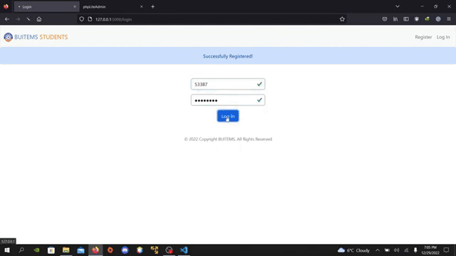

# BUITEMS STUDENTS: FLASK APPLICATION

## DESCRIPTION

This web-application helps students find friends with similar interests. It allows users to create a profile and select their interests from a predefined list. The application then matches the users with other users who have selected the same interests. The students can contact them via their contact email.

The students can also upload a profile picture when creating or editing their profile. Optionally, they also have option to add their **Twitter** or **LinkedIn** profile links.

## Architecture

This project is based on the MVC arhitecture.

## Libraries and Tools

The following tools and libraries are used in this project:

- [Python 3](https://www.python.org/)
- [os](https://flask.palletsprojects.com/en/2.2.x/patterns/fileuploads/)
- [re](https://www.programiz.com/python-programming/regex)
- [email_validator](https://stackoverflow.com/questions/61356834/wtforms-install-email-validator-for-email-validation-support)
- [Flask](https://flask.palletsprojects.com/)
- [Flask-Session](https://flask-session.readthedocs.io/)
- [Flask-MySQL](https://flask-mysql.readthedocs.io/en/stable/#)
- [Werkzeug](https://werkzeug.palletsprojects.com/)
- [Jinja](https://jinja.palletsprojects.com/en/3.1.x/)
- [SQLite](https://www.sqlite.org/)
- [HTML](https://www.w3schools.com/html/)
- [CSS](https://www.w3schools.com/css/)
- [JavaScript](https://www.w3schools.com/js/)
- [Bootstrap](https://getbootstrap.com/)

The project has also used a user-defind file; **helpers.py** which contains important helpers functions.

## IMPORTANT NOTICE

The database used in this project was not the official database of **BUITEMS University** but the project reflects the working if it was applied on the official database. One important feature would be included: Checking the registered CMSID, First and Last Name of the student, that if they are official students of the univeristy.

The words "student(s)" and "user(s)" are used interchangeably throughout this README file. So, do not get confused.

## Files

The project has various files which are briefly explained individually.

- **HTML Files**

  - **layout.html**

            The layout template starts by defining the DOCTYPE and the HTML element, and includes a link to an external stylesheet with Google fonts. It also includes links to the Bootstrap local stylesheet called "style.css".

            The layout template also includes a link to a favicon and sets the character encoding and viewport. The title of the page is defined by a block called "title", which will be replaced by the content of the block in a template that extends this layout.

            The layout template has a navbar element that contains a logo, a toggle button, and a list of links. The list of links is determined by a conditional statement that checks if the user is logged in. If the user is logged in, the navbar will contain links to the home page and the "Find Friends" page, as well as links to edit the user's profile and log out. If the user is not logged in, the navbar will contain links to the "Register" and "Log In" pages.

            The layout template also includes a header element that displays any flashed messages, and a main element that contains a block called "main". This block will be replaced by the content of the block in a template that extends this layout.

            The template also has a footer element that contains information about the website.

            At the end of the file, there are some script tags which contains local JavaScript file and the ones imported online from libraries like Bootstrap and Font Awesome.

            This file will be extended by rest of the HTML files to also used its functionality. A powerful feature of jinja.

  - **register.html**

            This file will generate the registration page. This page has an if-else condition where the if condition checks "if" any data (data_check_not -> first name, last name etc) or interests has come from the server. The former is used for saving the user's time in filling out the form from the beginning if the form did not pass all the validations from the server-side. The HTML structure will place the values of the "data_check_not" variable in their respective fields. The "interests_not" is used to display the interests so the user can select from them. The "not" word in both variables are used to specifiy that the form was not filled correctly.

            The "else" condition is executed when the user clicks on "Register" i.e. they reach on this page via "GET". The users will enter first name, last name, enrolled program, contact email, password and confirm password and they will select atleast one interest. These are the mandatory inputs. Optionally, the users can upload a profile picture and enter twitter and/or linkedin profile links.

  - **index.html**

            This file contains the code that shows the logged in user their homepage. There are if conditions using jinja syntax which are used to display if the user has LinkedIn and/or Twitter profiles links also included.

  - **edit.html**

            This HTML files contains the code which enables the users to edit their profiles like changing their email addresse, editing their interests (if they somehow change their interests), change their social media account links (twitter and/or linkedin), update their profile picture and/or change their password.

  - **friends.html**

            When the user clicks on "Find Friends", this file is executed on the browser which shows a list of all the students that has the same interests. The users can click on the "View Profile" button to check their profile and email them if they further want to get to know each other. This will only happen if any students are actually found on the basis of similar interests. (More info in app.py -> find() function).

  - **profile.html**

            This file shows the profile of the student on whose "View Profile" button from the "friends.html" page is clicked on by the user. The user can see their interest apart from the mututal one and the user can contact them via their contact email.

  - **login.html**

            As obvious by the name, this file generates the page that is used for logging in to the application.

- **CSS File**

      The CSS file contains colors for BUITEMS STUDENTS that appears as the brand in navbar. The file is not large as most of the styling for this project was done using Bootstrap. Check the file for the rest of the styling elements.

- **JavaScript Files**

  - **script.js**

        This script file contains the code that performs 3 tasks as follows:

        The first function, "check", is called when the user clicks on a interest checkbox. It counts how many interests the user has selected and displays an error message if the user has selected more than five interests or no interests at all. If the user has selected at least one interest, it hides the error message and allows the form to be submitted.

        The second function, which is self-executing, is used to add custom Bootstrap validation styles to the form. It prevents the form from being submitted if there are invalid fields, such as required fields that have not been filled out.

        The code also includes a section at the beginning of the file that updates the year in the footer of the page to the current year.

  - **password_validate.js**

        This file is dedicated just for password validation.

        The "validatePassword" function takes a password as input and checks if it meets all the password requirements, which are defined at the beginning of the code. The function returns true if the password is valid and false if it is invalid.

        The code adds an event listener to the password input field that calls the "validatePassword" function and displays a message indicating whether the password is valid or invalid. It also updates the list of password requirements to show which requirements have been met.

        The code also adds an event listener to the form that prevents it from being submitted if the password is invalid.

---

- **Python Files**

  - helpers.py

        This file contains functions for handling user login, image file uploads, and image file renaming in this web application built with the Flask framework.

    - **Functions**

      - **login_required(f)**

            It is a decorator function that can be applied to routes in this Flask application to require that a user be logged in in order to access them. The decorator wraps the route function f, and checks if the "cms_id" key is present in the session object. If it is not present, the user is redirected to the "/login" route. If the "cms_id" key is present, the route function f is executed as normal.

      - **allowed_file(filename)**

            It is a helper function that checks if the file with the given filename has an extension that is allowed for image files. It does this by checking if the "." character is present in the filename and if the file extension (the part of the filename after the last "." character) is contained in the ALLOWED_EXTENSIONS set. If both of these conditions are true, the function returns True, otherwise it returns False.

      - **edit_rename_file(filename)**

            This function is called when the users uploads a profile picture when editing their profile. It is a function that takes a filename and modifies it by replacing a portion of the name with the user's CMS ID (a unique identifier for the user). The function first splits the filename into two parts using the rsplit method, with the first part being the name of the file and the second part being the extension. It then replaces the first part of the filename with the user's CMS ID from the session object. Finally, it returns the modified filename.

      - **register_rename_file(filename, cms)**

            This function is called when a new user uploads a profile picture when registering. It is similar to the edit_rename_file function, but it takes an additional cms parameter which is the CMS ID of the user passed from the form. It uses this value to replace the first part of the filename instead of the CMS ID from the session object.

      - **edit_upload_image(image, db, app)**

            This function handles the process of uploading an image file to the server and storing its path in a database for a user who is already registered and logged in. The function first checks if the image file has an allowed extension using the allowed_file function. If the file has an allowed extension, the function gets the path of the user's previously uploaded image file from the database (if it exists), deletes the file from the server, and renames the image file with the user's CMS ID using the edit_rename_file function. The function then saves the image file to the server and updates the path of the image file in the database for the user. If the image file does not have an allowed extension, the function returns False.

      - **register_upload_image(image, cms, db, app)**

            It is similar to the edit_upload_image function, but it is intended for use when a new user is registering and uploading an image file. It takes an additional cms parameter which is the CMS ID of the new user, and uses this value to rename the image file using the register_rename_file function instead of the edit_rename_file function. The function then proceeds in the same way as the edit_upload_image function, saving the image file to the server and storing its path in the database for the new user.

      - **validate_email(email)**

            This function checks if a given email address is in a valid format. This is done by using email_validator library which is imported at the top of the code. The function uses the email_validator library to parse the email and check if it is in a valid format. If the email is valid, the function returns True, and if it is not valid, the function returns False.

      - **validate_password(password)**

            This function check that if a given password is valid according to some predefined criteria. This could include checks for minimum password length, the use of certain types of characters (e.g. uppercase letters, lowercase letters, numbers, special characters), and other password strength requirements. The function returns True if the password is valid, and False if it is not.

  - app.py

        This file handles the server-side of the project. The code sets up a Flask application and configures it to use a SQLite database for storing information about users and other application data. It also sets up a session to store user information and configures the application to auto-reload templates and to allow users to update their profile pictures by uploading images.

    - **Decorators**

      - **@app.after_request**

            This is a route decorator in a Flask application that runs a function after every request to disable caching of responses. It does this by setting certain HTTP headers in the response object, which tell the client (usually a web browser) not to cache the response and to check with the server for a new version of the resource each time it is requested. This can be useful for ensuring that users always see the most up-to-date version of a resource, especially when working with dynamic or frequently-changing content.

      - **@app.route**

            In a Flask application, a route decorator is used to specify the URL route and HTTP methods that a function should handle. The decorator is placed above the function definition and specifies the URL route as a string argument and the HTTP methods as a list of strings.

            A "GET" request is a request made by the client (usually a web browser) to retrieve data from the server. A "POST" request is a request made by the client to submit data to the server, typically in the form of a form submission.

            The function that is decorated by this route decorator will be executed whenever a request is made to the specified URL route using one of the specified HTTP methods. The function can then handle the request and generate a response to send back to the client.

            For example, if a user navigates to the root URL of the application in their web browser, a **GET** request will be made and the function decorated by this route decorator will be executed to handle the request and generate a response to be displayed in the user's browser.

      - **@login_required**

            This is a decorator function that is used to indicate that a route or function in a Flask application should only be accessible to logged-in users.

            If the user is not logged in, the decorator will typically redirect the user to a login page or display an error message. If the user is logged in, the decorator will allow the user to access the route or function as normal.

            The exact behavior of the login_required decorator will depend on how it is implemented in the application. It may check for the presence of a user session or for a valid login cookie, for example.

    - **Functions**

      - **login()**

            This function handles the user login pocess

            The function begins by clearing any existing user session data and then checks whether the request method is POST, which indicates that the login form has been submitted. If the request method is POST, the function retrieves the user's CMSID and password from the form submission and checks if the CMSID is a 5-digit number. If the CMSID is not a 5-digit number, the function displays a flash message and redirects the user back to the login page.

            The function then retrieves the student's password hash from the database using a SELECT statement and the execute method of the CS50 SQL library. If the student is not found in the database, the function displays a flash message and redirects the user back to the login page.

            If the student is found in the database, the function uses the check_password_hash function from the werkzeug.security module to compare the user's password with the stored password hash. If the passwords do not match, the function displays a flash message and redirects the user back to the login page. If the passwords match, the function stores the user's CMSID in the session and redirects the user to the home page.

            If the request method is not POST (i.e., the user has not submitted the login form), the function simply renders the login.html template for the user to fill out the login form and submit.

      - **logout()**

            The function simply clears any existing user session data and redirects the user back to the login page. This effectively logs the user out of the application and allows them to log in as a different user or exit the application.

            To use this function, the user would click on **Logout**, which would trigger an HTTP GET request to the logout route. The function would then be executed to clear the user's session data and redirect the user to the login page.

      - **register()**

            This function handles user registration. It allows users to enter their personal information, including their CMS ID, first name, last name, email, program, password, and profile picture, as well as select their interests from a list of available options. If the user has entered a Twitter or LinkedIn account, they can also enter those links.

            When the user submits the form, the function performs several checks to validate the input. If any of the required fields are not filled out or the entered password does not meet the required criteria, the function flashes an error message and re-renders the registration form with the previously entered data to save the user the effort of re-entering it.

            If the entered CMS ID already exists in the database, the function flashes an error message and redirects the user back to the login page. If the entered email is not valid, the function flashes an error message and re-renders the registration form.

            If the password and confirmation password do not match, the function flashes an error message and re-renders the registration form. If the user has not selected any interests, the function flashes an error message and re-renders the registration form.

            If all input is valid, the function generates a password hash using the generate_password_hash() function and stores the user's information in the database. If the user has provided a profile picture, the function uses the upload_image() function from the **helpers.py** file to store the image in a specified directory. The function then flashes a success message and redirects the user to the login page.

      - **index()**

            This function displays a user's profile information.

            The code first retrieves the student's data from the database by executing a SELECT statement using the CS50 SQL library's execute method. The execute method takes a SQL query as a string and any necessary parameters as arguments, and returns the result of the query as a list of dictionaries.

            The code then retrieves the student's interests from the database by executing another SELECT statement using the execute method. This query uses a SQL JOIN clause to combine data from multiple tables in the database and filter the results based on the student's CMSID, which is stored in the session.

            Finally, the code modifies the value of the student's PhotoPath field by converting it to a string and then renders the index.html template, passing the student's data and interests as variables to the template. The template can then use this information to display the student's profile information on the page.

      - **find()**

            This function searches for other students with mutual interests and displays their profiles.

            The function begins by retrieving the logged-in student's CMSID from the session. It then executes a SELECT statement using the CS50 SQL library's execute method to retrieve records of other students who have at least one mutual interest with the logged-in student. The query uses a combination of JOIN clauses and a WHERE clause to filter the results based on the mutual interests of the students.

            If the query returns no results (i.e., no students with mutual interests are found), the function displays a flash message using the Flask flash function and renders the friends.html template without passing any data to it. If at least one student with mutual interests is found, the function renders the friends.html template, passing the list of students with mutual interests as a variable to the template. The template can then use this information to display the names of the students with mutual interests and the user can click on **View Profile** button to check their profile.

      - **profile()**

            This function displays the profile of a student when the user clicks on View Profile.

            The function first checks whether the request method is POST, which indicates that the form has been submitted (hidden input field with the student's CMSID). If the request method is POST, the function retrieves the student's data from the database using a SELECT statement and the execute method of the CS50 SQL library. It also retrieves the student's interests from the database using another SELECT statement and the execute method.

            Finally, the function renders the profile.html template, passing the student's data and interests as variables to the template. The template can then use this information to display the student's profile information on the page.

      - **edit_profile()**

            This function allows a student to edit their profile information. The code does the following in the order shown below:

            It retrieves the student's current record from the database using student's CMSID. It also retrieves the student's interests from the database.

            If the form has been submitted (i.e., the request method is "POST"), the code updates the student's email address in the database if it has been changed.

            If the user has uploaded a new profile picture, the code calls the edit_upload_image function to handle the upload. If the image is not of an allowed file type (e.g., 'png', 'jpg', 'jpeg'), it displays an error message.

            The code updates the student's Twitter and LinkedIn links in the database if they have been changed.

            The code updates the student's interests in the database by inserting new rows into the student_interests table and deleting any rows (interests) that the student has de-selected. To do this, it retrieves the interests that are already stored in the database for the student and compares them to the interests that the student has selected on the form. If there are any new interests or any interests that are no longer selected, the code updates the student_interests table accordingly.

            Finally, the code redirects the user to the home page.

      - **change_password()**

            This allows a logged-in student to change their password.

            The function first checks if the request method is POST, which indicates that the user has submitted the form to change their password. It then retrieves the user's current password, new password, and confirmation of the new password from the form submission.

            The function then retrieves the student's current password hash from the database and checks if it matches the current password provided by the user. If it does, the function checks if the new password matches the confirmation of the new password. If both of these checks are successful, the function generates a new password hash using the generate_password_hash function from the werkzeug.security library, updates the student's password hash in the database using an UPDATE statement and the execute method, and redirects the user back to the profile edit page. If either of the checks fails, the function displays an error message and renders the edit.html template again.

            If the request method is not POST, the function simply renders the edit.html template with a message to change the password.

## Conclusion

In this project, I implemented several features to create a web application that allows students to find students on matching interests. Some of the key features that I implemented includes:

- Uploading profile pictures and the ability to change the image's name to student's CMSID and and social media links.

- The ability to handle file uploads and validate the file type for profile pictures.

- The ability to select and update the student's interests using checkboxes.

I encountered several challenges during the development process, such as working with file uploads, getting the students of similar interests. However, by researching online resources, I was able to overcome these challenges and successfully complete the project.

There are several potential enhancements that could be made in this application, such as:

- Allowing a user to crop their profile picture.
- Adding a search feature in "Find Friend" page to search for specific names in case of large number of records which is obviously the case in real world.
- Instead of emailing, this application would be better if students can add each other as friends. More like a University social media app.
- Most importantly, the UI could be improved.

I did not like to work on front-end. I spend most of the time working on back-end and serve-side. This project helped me find my area of interest and that is I am more of a back-end person and likes to solve logical problems.

I would like to thank the CS50 team for such a great course which helped me explore more of my potential and improved my problem-solving skills. This project would not have been possible without the help of resources mentioned in [Libraries and Tools](#libraries-and-tools).
